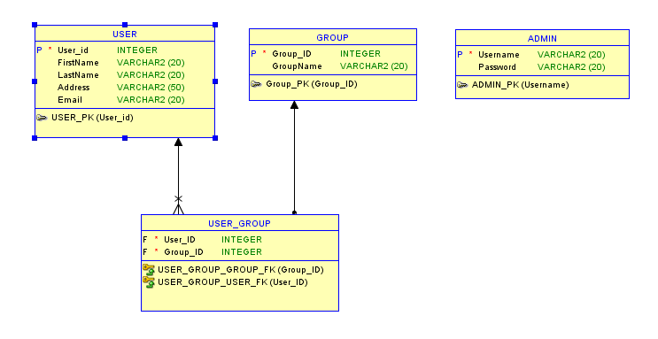
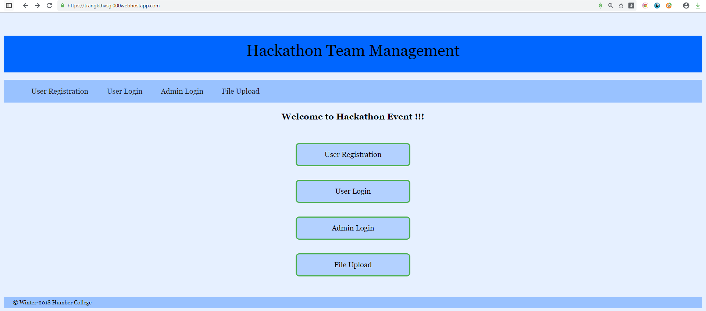
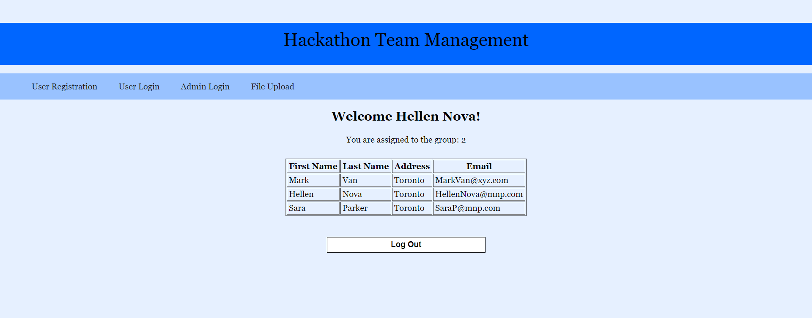
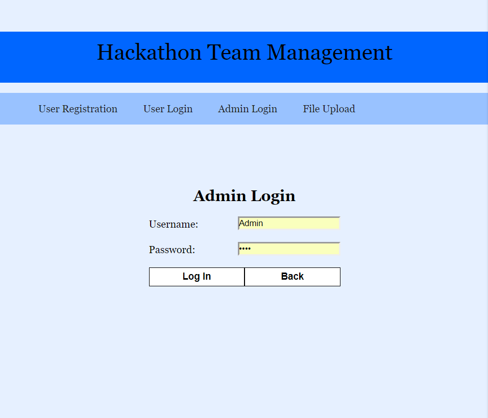
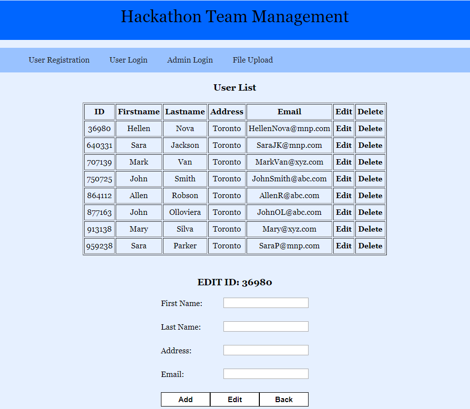
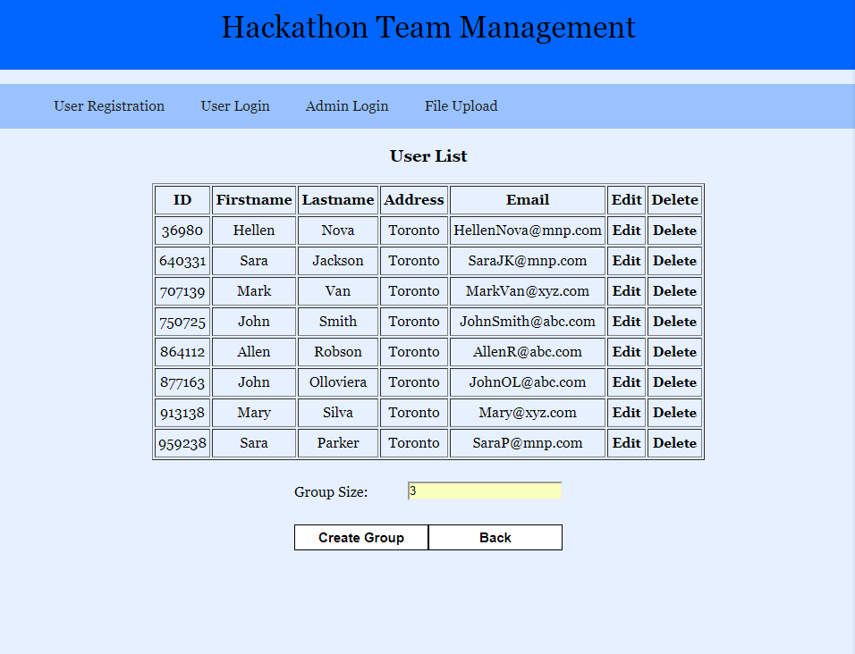

# Casey Trang Khuc code porfolio
Project 1: MVC ASP.NET https://github.com/khuctrang/FinalProject/

Project 2: 
Project for Open Source course in Fall 2018 with a classmate. [Details](https://github.com/khuctrang/Portfolio/blob/master/School%20Projects/OpenSource%20Final%20Project/Project-Report/Project2-Report.docx)
Its problem is for a competition in which, competitor can sign in, and admin can view all competitors then divide them into group of certain numbers.

Online version: https://trangkthvsg.000webhostapp.com/

### Used langugages
**Front-end:** HTML, CSS
**Back-end:** PHP

User View

Admin View (Admin)(qwer)

